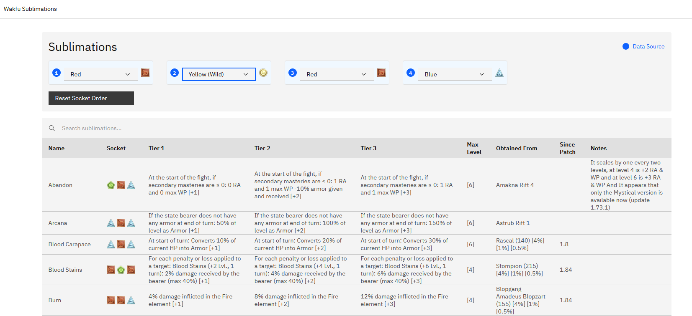

# Wakfu Sublimations

This was originally a site I used to see what Sublis I could use for a particular Item.

Rewrote from Angular to React via Vibe Coding

## 🎮 What are Sublimations?

Sublimations are special abilities in Wakfu that can be applied to equipment. Each sublimation has:
- **3 Socket Colors**: Red (R), Blue (B), Green (G)
- **3 Tiers**: Progressive power levels with increasing effects
- **Maximum Level**: The highest level the sublimation can reach
- **Source**: Where/how to obtain the sublimation
- **Patch Information**: When the sublimation was introduced

## 🔄 Data Sources

- **Primary Source**: Community Spreadsheet from Wakfu Discord
- **Official Guide**: [Wakfu Sublimations Forum Post](https://www.wakfu.com/en/forum/143-guides/241241-updated-sublimations)

## 🚀 Live Demo

**Live Site**: [https://wakfu-sublimations.noredlace.com/](https://wakfu-sublimations.noredlace.com/)

## 📝 License

This project is open source and available under the MIT License.

## 🙏 Acknowledgments

- Wakfu community for maintaining the sublimations database
- Carbon Design System team for the excellent UI components
- React and Vite teams for the development tools

**Note**: This tool is community-maintained and not officially affiliated with Wakfu or Ankama Games. Game data accuracy depends on community contributions and may not always reflect the latest game updates.